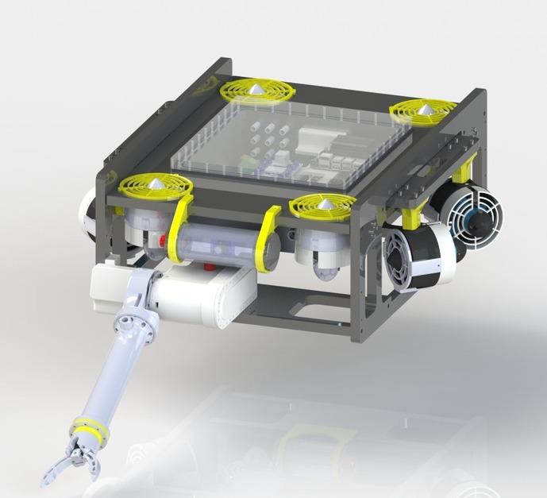

# EVA
<p align="center">

</p>

## Componetnts
The firmware for a specific component (ATMega only) can be find in [this](firmware/) directory, and the firmware of the nucleo in [this](nucleo/) directory.

### IP Mapping

* atmega_sensors: 10.0.0.2
* nucleo: 10.0.0.3
* atmega_camera_lights: 10.0.0.4
* atmega_power: 10.0.0.5
* atmega_arm: 10.0.0.6
* stazione di terra: 10.0.0.252
* mqtt broker (jetson): 10.0.0.254

### MAC Mapping

* atmega_sensors: 00 AA BB CC DE 02
* atmega_camera_lights: 00 AA BB CC DE 03
* nucleo: 00 AA BB CC DE 04
* atmega_power: 00 AA BB CC DE 05
* atmega_arm: 00 AA BB CC DE 06

## PoliTOcean GUI

The [GUI](gui/) is a remake in Python of the project [Monterey](https://github.com/rovsuite/monterey)

### Setting up the environment

1. Create a new virtual environment running
    ```bash
    python3 -m venv env
    ```

2. Activate the virtual environment systems via
      ```bash
      source ./env/bin/activate
      ```
    It can beand deactivated typing `deactivate`.

    On Windows system there is a dedicated script as well to enable and disable the environment in `./env/bin`.


3. Install all the required dependencies using PiP run

    ```bash
    ./env/bin/python3 -m pip install -r requirements.txt
    ```

We do recomend to **locally** ignore such folder adding in `.git/info/exclude` the following line
```
**/env
```

Your environment is set up.

### Run the code

```bash
python3 main.py
```
